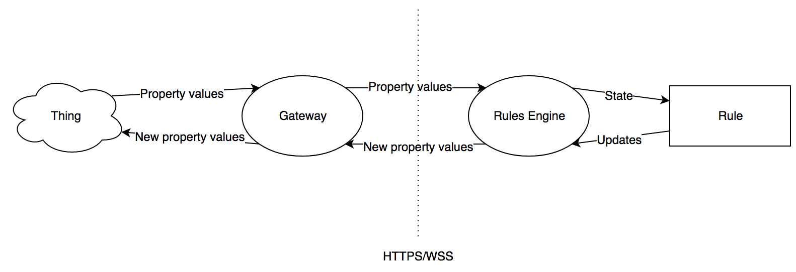

# rules-engine
Things Gateway Rules Engine Prototype

The rules engine takes a list of rules and communicates with the gateway to
translate the rules into effects on things. This is an early-stage
implementation that still needs testing and functionality improvements before
it will approach production-ready.

## Running the rules engine

To run the rules engine at this stage, you need to provide a valid JWT in
`static/src/jwt.js`. You will also need a gateway configured to allow CORS. If
this gateway isn't at `https://localhost:4443` you will have to update
`config/default.js` accordingly.

### Acquiring a JWT

Open the Gateway you want to talk to in a browser and run
`console.log(API.jwt);`. Copy the printed out text into `static/src/jwt.js`.

### Enabling CORS

In the Gateway's source directory, run `yarn add cors`. Then add `const cors =
require('cors');` and `app.use(cors())` to `src/app.js`. Note that this
degrades the security of the Gateway in a way that probably doesn't (but may)
have dire consequences.

Once you have all of this squared away, the engine can then be run with `npm
start`.

## Design

### Rules

A rule is a trigger and an action. In english, a rule can be represented as "if
`trigger` happens then do `action`". Triggers can be anything from observations
of things like "kitchen light is on" to abstract statements like "it's 9:00
AM". Right now actions are effects on thing properties, like "turn light on" or
"set thermostat to 25&deg;". In the future, both triggers and actions can
expand to include online services.

### System overview

The Rules Engine coordinates the rules by listening to the Gateway for thing
property changes. If a rule's trigger is met, the rule will tell the rules
engine its desired action. The engine will then communicate this action to the
gateway which then forwards it on to the physical thing.
